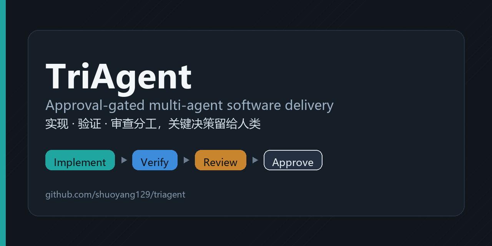
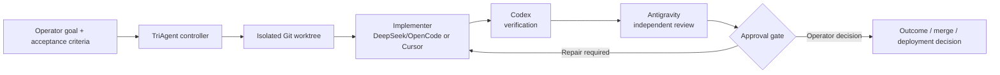

<div align="center">

# TriAgent



**Approval-gated multi-agent software delivery with isolated execution, independent verification, and auditable evidence.**

让实现、验证和审查由不同智能体分工完成，并把关键决策留给人类操作员。


</div>

TriAgent is a controller for running software-engineering tasks through a
separation-of-duties workflow. A configurable implementer changes the code,
Codex verifies the result, Antigravity performs an independent review, and the
controller stops at explicit approval gates before sensitive follow-up actions.

It is designed for operators who want more than a single agent saying “done”:
every task has a declared goal, testable acceptance criteria, risk level,
forbidden scope, persisted state, and a reviewable report.

## How it works


| Layer | Responsibility |
| --- | --- |
| Implementer | Produces the candidate change using Cursor or DeepSeek through a restricted OpenCode route. |
| Verifier | Uses Codex to check the candidate against the declared acceptance criteria and evidence. |
| Reviewer | Uses Antigravity as an independent final reviewer for defects and residual risk. |
| Controller | Enforces state transitions, budgets, timeouts, recovery rules, provenance, and approvals. |

The checked-in DGX profile currently routes **DeepSeek/OpenCode → Codex →
Antigravity**. Other profiles can select Cursor as the implementer without
changing the verifier or reviewer roles.

## Why TriAgent

- **Separation of duties** — implementation, verification, and review are
  performed by distinct provider roles.
- **Isolated changes** — task edits happen in a dedicated Git worktree, not in
  the source checkout.
- **Evidence over prose** — results are normalized into bounded structured
  outcomes, findings, artifacts, tests, and rollback information.
- **Fail-closed controls** — real provider runs require explicit live and
  billing confirmation flags.
- **Recoverable execution** — interrupted provider stages can resume from a
  persisted checkpoint without silently changing the selected provider route.
- **Risk-aware gates** — `robot-safety` tasks force visual approval, and
  approvals are recorded separately from the action they authorize.
- **Budget and timeout limits** — provider calls are bounded by call, time, and
  cost policies.

## Quick start

### Requirements

- Python 3.12+
- Git
- Authenticated provider CLIs only when using a real profile

Install from source:

```bash
git clone https://github.com/shuoyang129/triagent.git
cd triagent
python -m venv .venv
source .venv/bin/activate  # Windows: .venv\Scripts\activate
python -m pip install -e ".[test]"
triagent-v2 --version
```

### 1. Run a zero-provider rehearsal

Start with the `fake` profile. It validates the controller workflow without
calling a paid provider:

```bash
triagent-v2 doctor --profile fake

triagent-v2 run /path/to/repository "Add a health endpoint" \
  --profile fake \
  --data-root ./triagent-runs \
  --risk low \
  --acceptance "unit tests pass" \
  --visual-check none
```

### 2. Configure a real provider route

Copy one of the portable examples and update its paths and provider commands:

- [`profiles/dgx.example.toml`](profiles/dgx.example.toml)
- [`profiles/windows.example.toml`](profiles/windows.example.toml)

Then diagnose the profile before the first live run:

```bash
triagent-v2 doctor --profile profiles/local.toml

triagent-v2 run /path/to/repository "Add a health endpoint" \
  --profile profiles/local.toml \
  --data-root ./triagent-runs \
  --live-confirmed \
  --billing-confirmed \
  --risk low \
  --acceptance "unit tests pass" \
  --forbidden secrets/ \
  --visual-check none
```

`--live-confirmed` and `--billing-confirmed` are mandatory for non-fake
profiles. They make the provider and cost boundary explicit at the command
line; they are not inferred from configuration.

### 3. Inspect, recover, and approve

Use the same `--data-root` for every command associated with a task:

```bash
triagent-v2 status TASK_ID --data-root ./triagent-runs
triagent-v2 report TASK_ID --data-root ./triagent-runs

# Only FAILED_RECOVERABLE tasks can resume, using the original profile route.
triagent-v2 resume TASK_ID \
  --profile profiles/local.toml \
  --data-root ./triagent-runs \
  --live-confirmed \
  --billing-confirmed

# Record an operator decision only after reviewing the report.
triagent-v2 approve TASK_ID outcome --data-root ./triagent-runs
triagent-v2 approve TASK_ID merge --data-root ./triagent-runs
```

An approval records the operator's decision. It does **not** automatically
merge code, deploy software, run a destructive operation, or move a robot.

## Safety model

TriAgent treats provider output and task execution as untrusted until the
controller validates them. Important boundaries include:

- immutable execution provenance for resume operations;
- allowlisted structured provider output instead of retained raw reasoning;
- isolated candidate worktrees and explicit forbidden paths;
- separate implementation, verification, and review stages;
- bounded retry and repair loops;
- explicit approval requests for outcome, visual, merge, deployment, paid, and
  destructive decisions;
- read-only inspection routes for robot-safety repositories before any change
  workflow is considered.

For real robots, production systems, credentials, networks, and deployments,
TriAgent evidence is not a substitute for an operator's environment-specific
safety procedure.

## Profiles

| Profile | Purpose |
| --- | --- |
| `fake` | Zero-provider controller and workflow rehearsal. |
| [`profiles/dgx.example.toml`](profiles/dgx.example.toml) | Portable DGX starting point. |
| [`profiles/windows.example.toml`](profiles/windows.example.toml) | Portable Windows starting point. |
| [`profiles/dgx.spark.toml`](profiles/dgx.spark.toml) | Deployment-specific v2 profile; contains host-local paths and is not portable as-is. |

Never copy a machine-specific profile without reviewing its commands, paths,
provider enablement, budget, and timeout policy.

## Repository layout

```text
src/triagent/             Controller, state machine, adapters, reports, and safety checks
profiles/                 Fake, portable example, and deployment-specific provider routes
tests/                    Unit, contract, replay, recovery, packaging, and promotion tests
docs/operations/          Bootstrap and rollout procedures
docs/evidence/            Versioned runtime and promotion evidence
verification-manifests/   Reproducible verification policies
skills/triagent/          Codex operator skill for approval-gated TriAgent tasks
```

## Development

```bash
python -m pip install -e ".[test]"
python -m pytest
```

The test suite covers the CLI, state transitions, provider adapters, streaming
completion, task sizing, timeouts, recovery, runtime manifests, historical
replay, packaging, and promotion contracts.

## Documentation

- [Windows bootstrap](docs/operations/windows-bootstrap.md)
- [DGX bootstrap](docs/operations/dgx-bootstrap.md)
- [v2 promotion and rollback](docs/operations/v2-promotion-rollout.md)
- [Chinese operator guide](docs/triagent-user-guide-zh.md) — includes frozen v1
  historical material; use this README as the source of truth for v2 commands.

## Project status

TriAgent `0.2.0` is the active public v2 controller and is under active
development. Start with `fake`, review the selected profile, and keep real
provider, merge, deployment, destructive, and physical actions under explicit
operator control.
