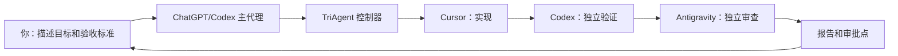
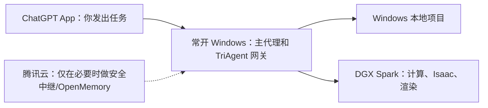

# TriAgent 中文使用手册

> 适用对象：希望主要在 ChatGPT/Codex App 中用自然语言下达任务、不希望经常阅读代码的使用者。
> 当前版本：2026-07-14。项目目录统一为 `D:\workspace`。

## 1. 先说结论：日常应该怎么用

这套系统的定位不是让你分别打开 Codex、Cursor 和 Antigravity，而是让你只面对一个主代理：

1. 你在 ChatGPT/Codex App 中说明“要得到什么结果”。
2. 主代理把任务转换成可执行的目标、验收标准、风险等级和禁止事项。
3. TriAgent 调用 Cursor 实现，调用 Codex 独立验证，再调用 Antigravity 独立审查。
4. 系统生成中文可解释的结果摘要，并在需要你决定的地方停下来。
5. 你只决定是否接受结果、是否允许合并、是否允许部署或执行危险操作。

你不需要逐行检查代码，但必须看五项结果：目标是否达成、测试是否通过、独立审查是否通过、是否有残余风险、系统现在等你批准什么。



### 当前已经能用的部分

- Windows 本机上的真实三代理链路已经完成一次端到端验收。
- 已验证的顺序是 Cursor 实现、Codex 验证、Antigravity 审查。
- 任务会使用独立 Git worktree，不直接在原始项目目录里试改。
- 任务状态、事件、候选代码和最终报告都会持久保存。
- 原生 DeepSeek Python fallback 目前默认关闭，没有发生调用。

### 当前还不能当作已经可用的部分

- ChatGPT App 远程控制局域网常开 Windows 主机尚未现场部署。
- DGX Spark 的 SSH、NVIDIA、Isaac Lab、显示器、WebRTC、tmux 和后台服务尚未现场验收。
- 腾讯云只能作为必要时的安全中继候选，目前不应对公网开放 TriAgent。
- `approve merge` 只记录“允许合并”，不会自动执行 Git 合并。
- `approve deploy` 只记录授权，不会自动部署。
- DeepSeek 只是预留位，目前并未真正接入 Cursor 自定义模型，也不会自动接力。

因此，出差期间可以使用本机开发主流程；回到局域网后，还要完成 Windows 网关和 DGX 的现场部署。

## 2. 三个代理分别负责什么

| 角色 | 当前工具 | 主要职责 | 一般额度特点 |
|---|---|---|---|
| 主代理 | ChatGPT/Codex App | 理解你的意图、拆解任务、启动流程、汇总结果、管理审批 | 对话和编排会消耗 Codex/ChatGPT 额度 |
| 实现代理 | Cursor Agent CLI | 阅读项目、修改代码、补测试、提交候选结果 | 通常消耗最大，因为实现过程最长 |
| 验证代理 | Codex CLI | 独立检查候选 worktree、运行测试、确认验收条件 | 通常中等，复杂验证会增加 |
| 审查代理 | Antigravity `agy` | 独立代码审查、发现缺陷和残余风险 | 通常较小，但大改动会增加 |
| 备用实现代理 | DeepSeek 预留位 | Cursor 不可用时的潜在实现替代 | 当前关闭，不消耗额度 |

一次顺利的小任务通常至少发生三次供应商模型调用：Cursor 一次、Codex 一次、Antigravity 一次。当前配置给每次调用记账为 1 美元估算值，所以成功的冒烟任务显示约 3 美元。这个数字是控制器的预算估算，不等于订阅账单，也不等于各家界面显示的实际 token 用量。

## 3. 你最推荐的使用方式：直接对主代理说中文

把下面模板保存下来。以后在 ChatGPT/Codex App 中复制，替换方括号内容即可。

```text
请使用 D:\workspace 中的 TriAgent 处理下面的任务。

项目仓库：[例如 D:\workspace\projects\robot-control]
目标：[只写最终要得到的结果]
风险等级：[low / medium / high / robot-safety]
验收标准：
1. [可以重复执行、能明确判断通过或失败的标准]
2. [第二项标准]
禁止事项：
1. 不修改 .env、密钥、数据集和模型权重
2. [项目特有的禁止目录或操作]
可视化检查：[none / optional / required]

先运行 doctor，确认三家 CLI 可用。
本任务允许轻量真实模型调用，并确认会消耗已有订阅额度。
DeepSeek 保持关闭。
运行到审批状态后停止，不要自动合并、部署或执行破坏性操作。
最后只用中文告诉我：结果、测试、独立审查、残余风险、额度估算、待批准事项。
```

### 一个普通软件任务的例子

```text
请使用 D:\workspace 中的 TriAgent 处理任务。
项目仓库：D:\workspace\projects\robot-dashboard
目标：给设备状态接口增加超时提示，并在前端显示“设备暂时离线”。
风险等级：medium
验收标准：
1. 后端超时时返回现有协议约定的离线状态
2. 前端能显示“设备暂时离线”
3. 相关自动化测试全部通过
禁止事项：不修改 .env、部署脚本和生产数据库配置
可视化检查：required
允许轻量真实调用并消耗订阅额度；DeepSeek 保持关闭。
完成审查后停在审批点，不合并、不部署。
```

### 一个 Isaac Lab 仿真任务的例子

```text
请先做代码修改和无界面自动化验证，不要声称已经完成现场 GUI 验收。
项目仓库：D:\workspace\projects\isaac-robot
目标：在 Isaac Lab 场景中增加机器人关节限位的可视化提示。
风险等级：robot-safety
验收标准：
1. 限位参数读取测试通过
2. 超限状态会触发明确的可视化提示
3. 原有测试全部通过
4. 回到 DGX 后通过真实 Isaac 场景截图和人工观察完成最终验收
禁止事项：不连接真实执行器，不修改驱动、急停、密钥和生产参数
可视化检查：required
允许轻量真实调用；完成代码审查后等待我的可视化批准。
```

`robot-safety` 会强制要求可视化检查。涉及真实机器人、关节限位、碰撞、执行器、急停或可能引起物理运动的任务，应优先使用该等级。

## 4. 如何写出好的任务，不需要懂代码

### 4.1 目标只描述结果

推荐：

- “让操作员在设备离线时看到明确提示。”
- “让 Isaac Lab 场景中的碰撞区域可视化。”
- “导入 CSV 后自动生成合格率报告。”

不推荐：

- “优化一下代码。”
- “修好所有问题。”
- “把系统做得更好。”

### 4.2 验收标准必须能判定通过或失败

推荐的验收标准：

- “运行指定测试命令，全部通过。”
- “输入空文件时返回明确错误，不崩溃。”
- “只允许修改 `app/` 和 `tests/`。”
- “Isaac 场景启动后生成指定截图，并由我人工确认。”

不够好的标准：

- “看起来没问题。”
- “代码优雅。”
- “尽量快。”

### 4.3 风险等级怎么选

| 等级 | 适用情况 | 示例 |
|---|---|---|
| `low` | 小范围、容易回滚、无敏感数据 | 文案、简单测试、小工具 |
| `medium` | 影响主要功能，但不涉及生产或物理安全 | API 行为、常规前后端功能 |
| `high` | 数据迁移、权限、安全、基础设施、生产配置 | 数据库迁移、认证、部署流程 |
| `robot-safety` | 可能影响真实机器人或安全边界 | 关节控制、碰撞、急停、执行器 |

拿不准时选更高一级，并在任务里说明“不允许部署或连接真实硬件”。

### 4.4 `visual-check` 怎么选

- `none`：纯后端、算法或命令行任务，没有界面判断。
- `optional`：界面变化很小，自动测试足以作为主要证据。
- `required`：网页、桌面窗口、图像、Isaac Lab、Isaac Sim、三维渲染或机器人安全相关任务。

## 5. Windows 第一次使用：安装和登录

以下操作只需在每台 Windows 工作机上做一次。所有命令在 PowerShell 中运行。

### 5.1 进入工作目录

```powershell
Set-Location D:\workspace
```

### 5.2 安装 TriAgent 命令

```powershell
$Py = "$env:LOCALAPPDATA\Programs\Python\Python312\python.exe"
& $Py -m pip install -e "D:\workspace"
$Tri = "$env:LOCALAPPDATA\Programs\Python\Python312\Scripts\triagent.exe"
& $Tri --help
```

如果 `$Tri` 文件暂时不存在，可以使用同一 Python 直接启动：

```powershell
& $Py -m triagent.cli --help
```

建议以后每次打开新 PowerShell 都先设置这些变量：

```powershell
$Py = "$env:LOCALAPPDATA\Programs\Python\Python312\python.exe"
$Tri = "$env:LOCALAPPDATA\Programs\Python\Python312\Scripts\triagent.exe"
$Profile = "D:\workspace\profiles\windows.example.toml"
$DataRoot = "D:\workspace\runs\production"
```

注意：配置文件中的 `[paths].runs` 目前不会自动替代命令行的 `--data-root`。为了避免“找不到任务”，同一任务的 `run`、`status`、`report`、`resume` 和 `approve` 必须始终使用同一个 `$DataRoot`。

### 5.3 登录 Codex

```powershell
codex
```

按照界面登录 ChatGPT Plus 对应账户，完成后退出交互界面。检查登录状态：

```powershell
codex login status
```

### 5.4 登录 Cursor Agent CLI

Cursor CLI 当前位于 Ubuntu 24.04 WSL 中：

```powershell
wsl -d Ubuntu-24.04 -- ~/.local/bin/cursor-agent login
wsl -d Ubuntu-24.04 -- ~/.local/bin/cursor-agent status
```

`status` 应显示已经登录。Cursor Pro 的桌面端登录与 WSL 中 Cursor Agent CLI 的登录状态可能不是同一件事，所以必须检查这个命令。

### 5.5 登录 Antigravity

```powershell
& "$env:LOCALAPPDATA\agy\bin\agy.exe"
```

按照界面完成 Gemini Pro/Antigravity 登录。当前 CLI 没有可靠的独立认证状态命令，TriAgent 只能结合可执行文件和本地配置判断；最终以一次轻量真实调用为准。

### 5.6 生成本机能力记录

```powershell
powershell -ExecutionPolicy Bypass -File D:\workspace\scripts\bootstrap-windows.ps1 `
  -Output work\capabilities\windows.json
```

这个 JSON 只应包含布尔值和版本信息，不应包含令牌、Cookie、API Key 或私钥。

### 5.7 运行诊断

```powershell
& $Tri doctor --profile $Profile
```

主要看三项：

- `installed=yes`：程序存在。
- `authenticated=yes`：能确认已经登录。
- `ready=yes`：具备被控制器调用的基本条件。

Antigravity 的 `authenticated` 可能显示 `unknown`；这不等于未登录，而是当前 CLI 缺少可靠的无交互认证查询。

## 6. 先用 fake 模式做一次零模型演练

`fake` 不调用 Codex、Cursor、Antigravity，也不消耗三家的模型额度。它只检查控制器、Git worktree、状态存储和报告链路。

要求：目标目录必须是 Git 仓库根目录，并且工作区干净。

```powershell
& $Tri run `
  --profile fake `
  --data-root $DataRoot `
  --risk low `
  --acceptance "控制器完成状态流转" `
  --visual-check none `
  "D:\workspace\projects\你的项目" `
  "执行一次不调用真实模型的流程演练"
```

fake 模式的结果不能证明真实模型、DGX、Isaac Lab 或远程控制可用。它只证明本地控制器基础链路能工作。

## 7. 运行一次真实三代理任务

### 7.1 运行前检查

真实任务开始前确认：

- 项目是 Git 仓库根目录。
- 原始工作区没有未提交修改；有修改时先让主代理帮助提交或妥善保存。
- `doctor` 没有明显安装错误。
- 任务目标和至少一条验收标准已经明确。
- 已决定是否需要可视化检查。
- 已明确允许轻量真实调用和订阅额度消耗。
- DeepSeek 仍保持关闭，除非你另行明确批准配置和测试。

### 7.2 命令示例

```powershell
& $Tri run `
  --profile $Profile `
  --live-confirmed `
  --billing-confirmed `
  --data-root $DataRoot `
  --risk medium `
  --acceptance "新增功能的自动化测试通过" `
  --acceptance "原有测试全部通过" `
  --forbidden ".env" `
  --forbidden "secrets/" `
  --visual-check none `
  "D:\workspace\projects\你的项目" `
  "用一句话描述最终目标"
```

PowerShell 的反引号 `` ` `` 是换行符。反引号后不要留空格。也可以把整条命令写在一行。

两个确认参数的含义：

- `--live-confirmed`：你明确允许调用真实供应商模型。
- `--billing-confirmed`：你明确知道本次会消耗已有订阅或未来配置的付费额度。

缺少任意一个确认，真实任务会在模型调用前拒绝执行。

### 7.3 正常输出

命令结束时会显示类似内容：

```text
Task: 9d75a0a5-4256-4e21-8eb6-a82430ec9b91
State: APPROVAL
Report: D:\workspace\runs\...\final-report.md
```

请保存 `Task` 后面的任务 ID。`APPROVAL` 通常代表实现、验证和审查已经结束，正在等你批准，不代表失败。

## 8. 查看进度和结果

### 8.1 查看当前状态

```powershell
$TaskId = "把任务 ID 放在这里"
& $Tri status $TaskId --data-root $DataRoot
```

这条命令只读取本地状态，不会调用三家模型。

### 8.2 查看完整报告

```powershell
& $Tri report $TaskId --data-root $DataRoot
```

也可以直接打开：

```text
D:\workspace\runs\production\runs\<TASK_ID>\final-report.md
```

### 8.3 报告八项怎么读

| 字段 | 你要关注什么 |
|---|---|
| `state` | 当前流程停在哪里 |
| `user outcome` | 实现代理声称完成了什么 |
| `tests` | Codex 的独立验证及测试证据 |
| `independent review` | Antigravity 的独立审查结论 |
| `visual artifacts` | 截图、视频或渲染证据；GUI 任务缺失时不要批准 |
| `residual risk` | 仍然存在的风险或审查发现 |
| `rollback` | 出问题时如何恢复；缺失时不建议部署 |
| `pending approval` | 系统明确等待你批准的动作 |

不要只看 `user outcome`。至少要同时确认 `tests`、`independent review`、`residual risk` 和 `pending approval`。

## 9. 状态含义和你应该做什么

| 状态 | 含义 | 建议动作 |
|---|---|---|
| `SPEC` | 任务规格已建立 | 等待控制器开始或检查输入 |
| `IMPLEMENT` | Cursor 正在实现 | 等待，不要同时修改原项目 |
| `VERIFY` | Codex 正在独立验证 | 等待测试完成 |
| `REVIEW` | Antigravity 正在独立审查 | 等待审查完成 |
| `REPAIR` | 审查发现重要问题，正在返修 | 等待；低/中风险最多通常两轮，高/机器人安全最多三轮 |
| `APPROVAL` | 正常到达审批点 | 阅读报告后决定批准哪些动作 |
| `WAITING_FOR_VISUAL_APPROVAL` | 等待你确认截图或实际窗口 | 必须亲自看到证据再批准 `visual` |
| `WAITING_FOR_GUI` | 需要现场图形界面 | 等回到 DGX/显示器环境处理 |
| `WAITING_FOR_USER` | 缺少用户决定或信息 | 回答报告中明确的问题 |
| `PAUSED_BUDGET` | 达到调用次数、时间或估算金额限制 | 不要盲目重跑；让主代理先检查已保存成果和剩余额度 |
| `FAILED_RECOVERABLE` | 某阶段失败，但允许在原任务上恢复 | 修复登录、网络或工具问题后，用同一 profile 执行 `resume` |
| `FAILED_FINAL` | 达到返修上限或不可恢复失败 | 保留证据，分析原因后创建新任务；不要修改状态文件伪造恢复 |

## 10. 失败后如何恢复

只有 `FAILED_RECOVERABLE` 可以使用 `resume`。

```powershell
& $Tri resume $TaskId `
  --profile $Profile `
  --data-root $DataRoot `
  --live-confirmed `
  --billing-confirmed
```

恢复流程有几个安全限制：

- 必须使用原任务相同的 profile。
- 必须保持原来的实现代理、验证代理和审查代理身份。
- 已经通过的阶段不会重复调用。
- 剩余调用次数、时间、金额和返修次数不会重置。
- Cursor 创建的任务不能在 `resume` 时偷偷改成 DeepSeek。
- profile 内容发生变化造成摘要不一致时，恢复会拒绝执行。

最适合对主代理说：

```text
请检查 TriAgent 任务 [TASK_ID] 的状态和报告。
如果是 FAILED_RECOVERABLE，先说明失败阶段、是否会再次消耗模型额度、剩余预算；
得到我确认后，使用原 profile 和原 data-root 恢复。
不要新建任务，不要修改 state.json 或数据库。
```

## 11. 如何审批

### 11.1 接受结果，但暂不合并

```powershell
& $Tri approve $TaskId outcome --data-root $DataRoot
```

### 11.2 允许合并

```powershell
& $Tri approve $TaskId merge --data-root $DataRoot
```

### 11.3 批准可视化结果

仅在你亲自看过截图、视频、WebRTC 或 DGX 显示器画面后执行：

```powershell
& $Tri approve $TaskId visual --data-root $DataRoot
```

当前“可视化批准后继续请求 outcome/merge”的完整路径尚未在 DGX 现场验收。执行 `visual` 后应先重新运行 `report`；如果报告没有明确列出新的 pending approval，不要强行批准 outcome 或 merge，而是让主代理检查状态。

### 11.4 非常重要的审批边界

- 审批命令只记录授权。
- `approve merge` 不会自动执行 Git 合并。
- `approve deploy` 不会自动部署。
- `approve destructive` 不会自动执行删除或破坏性命令。
- 合并、部署和破坏性执行必须作为后续独立操作，由主代理再次核对准确候选版本和授权范围。
- 不要批准报告中没有列为 `pending approval` 的动作；控制器会拒绝不匹配的审批。

如果你不看代码，推荐直接告诉主代理：

```text
我接受任务 [TASK_ID] 的结果，但暂不批准合并和部署。请只记录 outcome 批准。
```

需要合并时再说：

```text
请重新读取任务 [TASK_ID] 的最终报告，确认测试、独立审查和候选版本没有变化。
如果完全一致，我批准 merge，并授权你执行受控合并；不要部署。
合并后重新运行测试，并用中文报告结果。
```

## 12. 额度管理和 DeepSeek 备用位

当前 Windows profile 的限制是：

- 最多 20 次代理调用。
- 最长 60 分钟。
- 最多 20 美元控制器估算值。
- Codex、Cursor、Antigravity 每次各按 1 美元估算。
- `allow_paid_overage = false`，不允许自动超预算。

### 12.1 谁通常消耗最多

Cursor 通常消耗最大，因为它负责阅读项目、实现、测试和修正。Codex 验证居中，Antigravity 单次审查通常最小。但主代理本身也会使用 ChatGPT/Codex 额度，所以 Codex 的总消耗包括“与你对话和编排”以及“独立验证”两部分。

### 12.2 如何节省额度

- 一次只做一个清晰目标。
- 验收标准控制在 2～5 条，必须可执行。
- 明确禁止目录，减少无关扫描和修改。
- 小任务优先；大任务拆成几个可独立验收的任务。
- 先用 `fake` 检查控制器，再决定是否真实调用。
- 只用 `status` 和 `report` 查询进度，不会消耗模型额度。
- `FAILED_RECOVERABLE` 先查原因，修好登录或环境后再恢复，避免反复失败。

### 12.3 DeepSeek 当前真实状态

TriAgent 已改为原生 OpenAI-compatible Python SDK fallback，不再使用 Cursor Custom Model 或 OpenCode。默认 profile 仍保持关闭：

```toml
[agents.deepseek]
enabled = false
model = "deepseek-v4-flash"
base_url = "https://api.deepseek.com"
estimated_usd = 1.0
probe_estimated_usd = 0.25
```

启用前必须由操作者在进程环境中设置 `DEEPSEEK_API_KEY`，并将 `enabled` 改为 `true`。密钥不能写入 TOML、任务提示或日志。真实 `run`/`resume` 仍必须显式传入 `--live-confirmed --billing-confirmed`；readiness probe 和实现调用都会先占用控制器预算。如果密钥保存在 `~/.env`，必须先将其导出到 TriAgent 进程环境，不能只做未导出的 shell 赋值。readiness 失败只持久化认证、余额、模型列表、限流、超时、连接、请求、服务或 smoke-invalid 等白名单诊断码，不保存供应商响应正文。

原生 adapter 不给模型 shell 或任意工具权限。它只提供大小受限的 Git 跟踪 UTF-8 文本快照，并只接受结构化相对路径 `write`/`delete` 操作；本地控制器会拒绝绝对路径、`..`、`.git`、符号链接、重复路径、超量或超大变更，再原子写入。最终候选仍经过 scope/forbidden、Codex 验证和 Antigravity 审查。

DeepSeek 只能在创建任务时被选为实现器；同一个已开始任务的执行来源和 profile digest 不可变，不能在恢复时从 Cursor 偷换成 DeepSeek。当前路由只有在 Cursor readiness 不可用且 DeepSeek 已显式启用并通过付费 readiness 时才会选择它；Cursor 运行中途额度错误的自动重路由仍需另行实现和验证。

## 13. 为什么有时 Cursor 和 Antigravity 额度没有变化

常见原因：

1. 使用了 `--profile fake`，整个流程没有调用真实模型。
2. 任务在输入校验、Git 校验、profile 校验或登录检查阶段就失败了。
3. Cursor 实现失败，流程没有走到 Antigravity 审查阶段。
4. 只运行了 `doctor`、`status` 或 `report`；这些不等于完整模型任务。
5. 供应商后台的额度显示存在延迟或统计口径不同。

让主代理检查以下证据，不要只凭额度页面判断：

- `state.json` 中的 execution provenance。
- `events.jsonl` 的阶段流转。
- `final-report.md` 的验证和审查结果。
- 控制器 runtime 中的 `agent_calls`、`completed_calls` 和 `interrupted_calls`。

一条真实成功链路应至少能证明 implementer=`cursor`、verifier=`codex`、reviewer=`antigravity`，并且三个供应商阶段都完成。

## 14. 任务文件保存在哪里

统一使用 `$DataRoot = D:\workspace\runs\production` 时，每个任务位于：

```text
D:\workspace\runs\production\runs\<TASK_ID>\
```

常见文件：

| 文件 | 用途 |
|---|---|
| `task.yaml` | 原始目标、范围、验收标准、风险和预算 |
| `state.json` | 当前任务状态 |
| `events.jsonl` | 不可变的状态流转记录 |
| `handoff.json` | 实现代理交给验证/审查代理的候选材料 |
| `final-report.md` | 你最应该阅读的最终摘要 |
| `worktree\` | 隔离的候选代码，不是原项目目录 |

不要手工编辑这些状态和证据文件，也不要在任务未完成或未合并前删除 `worktree`、候选分支或 runs 目录。

## 15. 常见故障处理

### 15.1 `triagent` 无法识别

重新设置变量并使用完整路径：

```powershell
$Py = "$env:LOCALAPPDATA\Programs\Python\Python312\python.exe"
& $Py -m pip install -e "D:\workspace"
$Tri = "$env:LOCALAPPDATA\Programs\Python\Python312\Scripts\triagent.exe"
& $Tri --help
```

### 15.2 `task input validation failed`

优先检查：

- 传入的是否为 Git 仓库根目录，而不是子目录。
- Git 仓库是否至少有一次提交。
- 原始工作区是否有未提交修改。
- profile 路径是否正确。
- 三个代理的 command 配置是否存在且非空。

### 15.3 `task setup failed; inspect persisted task status`

不要立即重跑。先找到输出中的 Task ID，然后：

```powershell
& $Tri status $TaskId --data-root $DataRoot
& $Tri report $TaskId --data-root $DataRoot
```

候选 worktree 和分支通常会被保留，便于恢复和调查。

### 15.4 `task resume refused`

常见原因：

- 状态不是 `FAILED_RECOVERABLE`。
- 使用了不同 profile。
- profile 内容在任务开始后发生变化。
- 任务最初是 live，现在试图用 fake 恢复。
- 任务最初由 Cursor 实现，现在试图改成 DeepSeek。
- 已经达到调用、时间、金额或返修上限。

### 15.5 状态是 `APPROVAL`

这通常是正常完成到审批点，不是程序卡住。阅读报告中的 `pending approval`，只批准你理解和接受的动作。

### 15.6 可视化证据是 `unknown/missing`

如果任务要求界面或 Isaac 可视化，不应批准最终结果。等到能连接 DGX 显示器或 WebRTC 后补做现场验收。纯后端且 `visual-check=none` 的任务出现该字段可以是正常情况。

## 16. 回到局域网后的常开 Windows 主机方案

目标架构是：



常开 Windows 主机应负责：

- 保持 Codex、Cursor 和 Antigravity 的登录状态。
- 保存 TriAgent 配置、任务数据库和审批记录。
- 作为 ChatGPT App 与局域网/DGX 之间的受控入口。
- 在执行真实调用、合并、部署、GUI 或破坏性动作前保持审批门。
- 使用私有隧道或私有组网，不直接向公网暴露 TriAgent 端口。

现场需要完成：

1. 安装 Git、Python 3.12、WSL Ubuntu 24.04、Codex CLI、Cursor Agent CLI、Antigravity CLI。
2. 安装 TriAgent 并复制经过验证的 profile。
3. 三家 CLI 分别登录并运行 `doctor`。
4. 配置 Windows 不自动休眠，并确认重启后的登录与服务行为。
5. 建立到 DGX 的安全 SSH/私有网络连接。
6. 从 ChatGPT App 发起一次轻量任务，确认任务确实在常开 Windows 上执行。
7. 验证断网、重连、重启和任务恢复。

这部分目前是待办，不要把出差电脑上的成功结果当作常开 Windows 已经部署完成。

## 17. DGX Spark 和 Isaac Lab 的使用边界

### 17.1 第一次到 DGX 上先做只读诊断

```bash
cd /srv/triagent
bash scripts/bootstrap-dgx.sh
```

脚本会检查 `python3`、`git`、`codex`、`cursor-agent`、`agy`、`nvidia-smi`、`docker`、`systemctl` 和 `tmux` 是否存在，不会自动安装驱动或 Isaac Lab。

只有在你明确批准并处于交互终端时才运行：

```bash
bash scripts/bootstrap-dgx.sh --install
```

这个安装模式也只安装 Python、Git 和 tmux 等基线包，不负责 NVIDIA 驱动、容器工具链、Isaac Sim、Isaac Lab 或三家 CLI 的完整部署。

### 17.2 现场必须逐项验收

- Windows 到 DGX 的 SSH 可达性。
- DGX 上三家 CLI 的版本和登录状态。
- NVIDIA GPU、驱动和容器 GPU 访问。
- `systemd --user` 服务在重启和重新登录后的行为。
- 显示器、本地图形会话和测试窗口。
- Isaac Lab/Isaac Sim 冒烟场景。
- WebRTC 画面和交互。
- tmux 在 SSH 断开后仍持续运行，并可重新连接。
- ChatGPT App 经常开 Windows 发起远程任务的完整证据。

详细现场清单见 `D:\workspace\docs\operations\dgx-onsite-checklist.md`。

### 17.3 有渲染窗口的任务应该怎么下达

在任务里明确指定：

- 是在 DGX 本地显示器看，还是通过 WebRTC 看。
- 是否允许使用当前图形会话。
- 后台计算放在哪个 tmux 会话。
- 需要保存哪些截图、视频、日志和时间戳。
- 未看到真实画面前，不允许把任务标记为可视化验收通过。
- 涉及真实硬件时，默认不连接执行器，除非你另行明确批准。

## 18. 腾讯云服务器怎么用

腾讯云 2 核 4G 服务器目前已有 OpenMemory，可以继续承担记忆服务。只有当常开 Windows 与 ChatGPT/DGX 的私有直连方案确实不可用时，才考虑把它作为中继。

安全原则：

- 不直接把 TriAgent、Windows 远程桌面或 DGX SSH 裸露到公网。
- 不在腾讯云保存 Codex、Cursor、Gemini/Antigravity 的长期明文令牌。
- 不把云服务器当作机器人控制器或 Isaac 渲染主机。
- 中继只转发经过身份认证和加密的连接。
- OpenMemory 与任务控制权限分离。

## 19. 日常操作速查表

### 开始前

```powershell
Set-Location D:\workspace
$Tri = "$env:LOCALAPPDATA\Programs\Python\Python312\Scripts\triagent.exe"
$Profile = "D:\workspace\profiles\windows.example.toml"
$DataRoot = "D:\workspace\runs\production"
& $Tri doctor --profile $Profile
```

### 新建并运行真实任务

```powershell
& $Tri run --profile $Profile --live-confirmed --billing-confirmed `
  --data-root $DataRoot --risk low --acceptance "测试全部通过" `
  --visual-check none "D:\workspace\projects\你的项目" "你的目标"
```

### 查询

```powershell
& $Tri status $TaskId --data-root $DataRoot
& $Tri report $TaskId --data-root $DataRoot
```

### 恢复

```powershell
& $Tri resume $TaskId --profile $Profile --data-root $DataRoot `
  --live-confirmed --billing-confirmed
```

### 审批

```powershell
& $Tri approve $TaskId outcome --data-root $DataRoot
& $Tri approve $TaskId visual --data-root $DataRoot
& $Tri approve $TaskId merge --data-root $DataRoot
```

只执行报告中明确列为 pending 的审批，不要把三条审批命令一次性全部运行。

## 20. 当前已验证的真实样例

截至 2026-07-14，已完成的真实三代理冒烟任务：

- Task ID：`9d75a0a5-4256-4e21-8eb6-a82430ec9b91`
- 状态：`APPROVAL`
- 实现：Cursor，完成。
- 验证：Codex，测试 `2 passed`。
- 审查：Antigravity，`clean`，没有发现问题。
- 三个供应商阶段共完成 3 次调用，控制器估算 3 美元。
- 原生 DeepSeek fallback 未启用、未调用。
- 待审批：`outcome`、`merge`。
- 报告：`D:\workspace\runs\live-smoke-v4\runs\9d75a0a5-4256-4e21-8eb6-a82430ec9b91\final-report.md`

这个样例证明 Windows 本地三代理代码流程可以走通，但不证明 ChatGPT App 远程控制、常开 Windows、DGX、NVIDIA、Isaac Lab、WebRTC 或现场 GUI 已经完成。

## 21. 最后记住六条

1. 你负责说清楚结果、验收标准和禁止事项，不需要逐行看代码。
2. 日常只让主代理调用 TriAgent，不要手动绕过它分别调用三家 CLI。
3. `APPROVAL` 通常是正常的人工决策点，不是失败。
4. 审批只记录授权，合并和部署仍是独立动作。
5. GUI、Isaac 和机器人任务没有真实画面证据就不要批准。
6. 当前远程 Windows/DGX 和 DeepSeek 自动接力仍未完成，不能按“已可用”操作。
